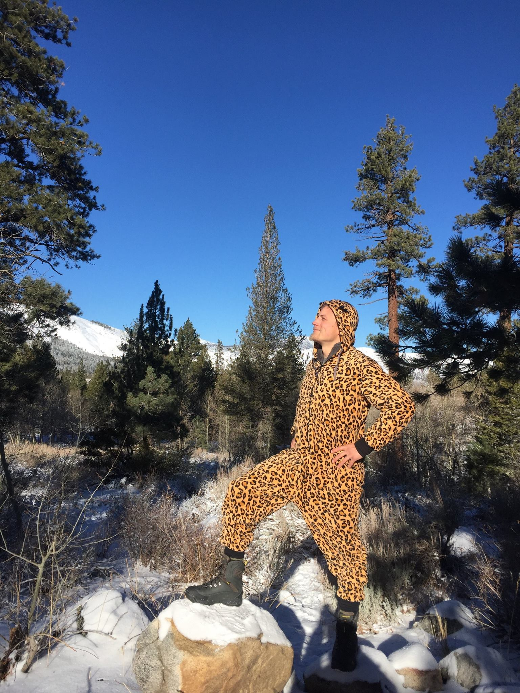

# Assignment: Introduction to GitHub and R

## 1. Name: Jonathan Raberg

> Add your name in the heading above.

## 2. Course Goals

> List three goals you would like to accomplish through this class. This can be anything from things you'd like to know, skills you'd like to learn or improve, concepts you'd like to understand or apply, etc.

1.  Fractionation in biogeochemical processes and biosynthetic pathways
2.  R programming in general
3.  When an interpretation of an isotopic data set is reasonable and when it is problematic

## 3. Something fun

> Add a picture of yourself doing something you enjoy outside school (hiking, cooking, playing music, reading, etc) to the [`images`](images) folder and link to it here with a descriptive title (for mouseover).

## 4. ???

> Include something of your own choosing not described above. Anything. Be creative!

A palindromic poem (punctuation and spaces between letters are different, but otherwise the same forwards and backwards!):

"Dammit I'm Mad"

by

Demetri Martin

Dammit I'm mad.
Evil is a deed as I live.
God, am I reviled? I rise, my bed on a sun, I melt.
To be not one man emanating is sad. I piss.
Alas, it is so late. Who stops to help?
Man, it is hot. I'm in it. I tell.
I am not a devil. I level "Mad Dog".
Ah, say burning is, as a deified gulp,
In my halo of a mired rum tin.
I erase many men. Oh, to be man, a sin.
Is evil in a clam? In a trap?
No. It is open. On it I was stuck.
Rats peed on hope. Elsewhere dips a web.
Be still if I fill its ebb.
Ew, a spider… eh?
We sleep. Oh no!
Deep, stark cuts saw it in one position.
Part animal, can I live? Sin is a name.
Both, one… my names are in it.
Murder? I'm a fool.
A hymn I plug, deified as a sign in ruby ash,
A Goddam level I lived at.
On mail let it in. I'm it.
Oh, sit in ample hot spots. Oh wet!
A loss it is alas (sip). I'd assign it a name.
Name not one bottle minus an ode by me:
"Sir, I deliver. I'm a dog"
Evil is a deed as I live.
Dammit I'm mad.

## 5. Intro to R

Go to [http://tryr.codeschool.com/](http://tryr.codeschool.com/) and complete lessons 1-4. For each of the lessons, answer the following questions:

### 5.1 What is the output of the last command in chapter 1?
"Will ye be me pen pal?"

### 5.2 What is the output of the last command in chapter 2?
20

### 5.3 What kind of plot is produced by the last command in chapter 3?
Heat map of a volcano

### 5.4 What kins of plot feature is added by the last command in chapter 4?
A horizontal line at one standard deviation below the mean
